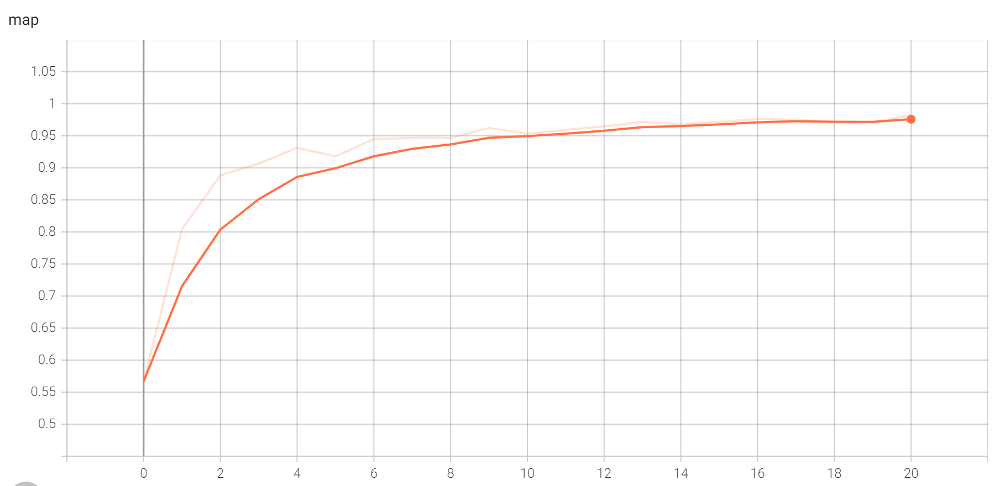
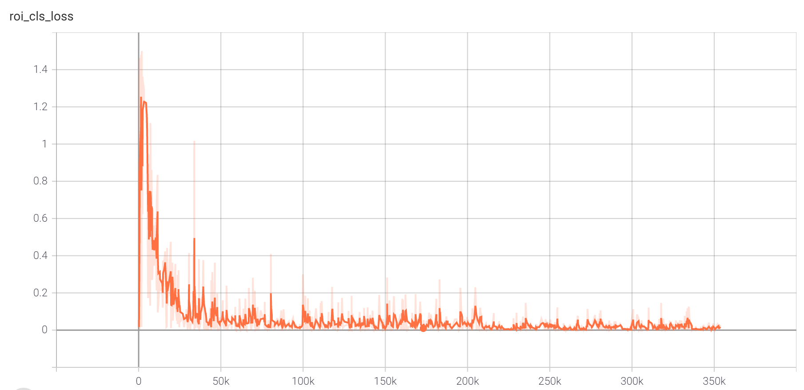
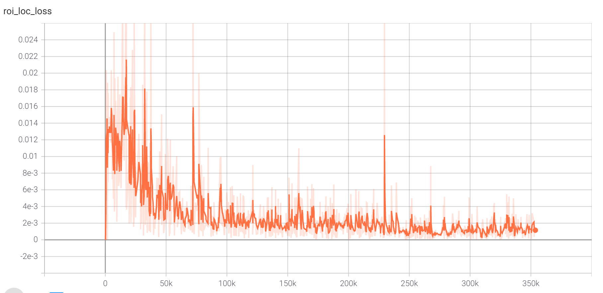
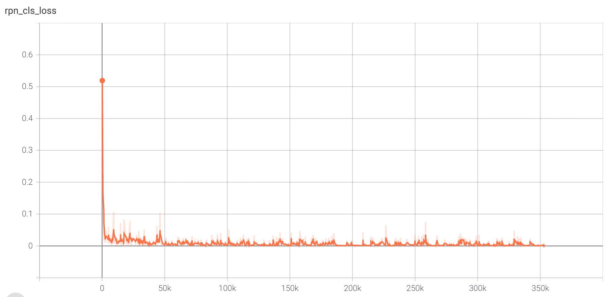
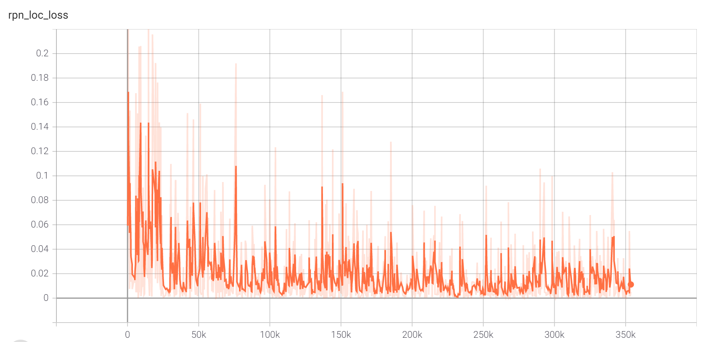
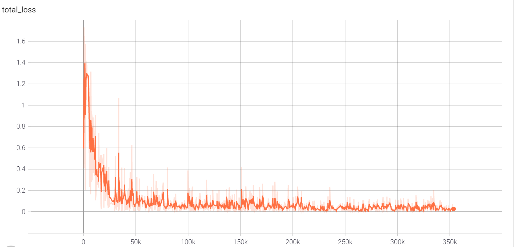

# Traffic Sign Detection
本项目为2021年第一届“计图”人工智能算法挑战赛-交通标志检测的Baseline。深度学习框架为[Jittor](https://cg.cs.tsinghua.edu.cn/jittor/)。

比赛链接如下：
1. [2021年第一届“计图”人工智能算法挑战赛-交通标志检测](https://www.educoder.net/competitions/index/Jittor-1)
2. [2021年第一届“计图”人工智能算法挑战赛-狗细分类](https://www.educoder.net/competitions/index/Jittor-2)

### 项目文件
```shell
TrafficSignDetection
├── dataset
│   ├── augmentation.py # 数据增强方法
│   ├── data.py # Dataset
│   └── transforms.py # 图片数据处理
├── model
│   ├── faster_rcnn.py 
│   ├── resnet.py
│   ├── roi_head.py
│   └── rpn.py
├── utils
│   ├── ap_eval.py
│   ├── box_ops.py
│   ├── roi_align.py
│   └── visualize.py
├── evaluate.py
├── train.py
├── README.md
└── requirements.txt
```

### 数据集

```shell
# 下载训练数据集
wget https://cg.cs.tsinghua.edu.cn/traffic-sign/tt100k_2021.zip
unzip tt100k_2021.zip

# 下载A榜数据集
wget -O TT_TEST_A.zip https://cloud.tsinghua.edu.cn/f/14252d9ad07b4d7b86d4/?dl=1
unzip TT_TEST_A.zip

# 下载Baseline数据增强使用的部分marks
cd tt100k_2021
wget https://cg.cs.tsinghua.edu.cn/traffic-sign/re_marks.zip
unzip re_marks.zip
```
```shell
tt100k_2021
├── annotations_all.json
├── marks.jpg
├── report.pdf
├── test_result.pkl
├── marks
│   └── <mark name>.png
├── re_marks
│   └── <mark name>.jpg
├── train
│   └── <image id>.jpg
├── test
│   └── <image id>.jpg
└── other
    └── <image id>.jpg
```
### 模型

检测模型为Faster RCNN, Backbone为ResNet。

目前的训练基于ResNet50。

训练参数如下：
1. 图片尺寸：2048\* 2048
2. Batch Size: 1
3. Epoch: 20
4. LR: 0.001
 
### 模型训练和测试
#### 安装依赖库：
```shell
python3 -m pip install -r requirements.txt
```
#### 模型训练：
训练之前先进行数据增强：
```shell
python3 dataset/augmentation.py
```

训练前需要设置数据集的位置，具体设置方式为**train.py**中Line18-22。
Batch Size,lr,num_workers等等请参考**train.py**中的train函数。
训练过程的显存消耗如下：
```shell
| GeForce RTX 3090 |  23629MiB / 24268MiB |  79%  |
```
因为图片尺寸较大，当显存较小时请缩小图片尺寸或者对图片进行裁剪，缩小图片尺寸代码在**dataset/transforms.py**里：
更改min_size和max_size即可
```python
def build_transforms(min_size=2048,
                     max_size=2048,
                     flip_horizontal_prob=0.5,
                     mean=[102.9801, 115.9465, 122.7717],
                     std = [1.,1.,1.],
                     to_bgr255=True):
    

    transform = Compose([
            Resize(min_size, max_size),
            RandomHorizontalFlip(flip_horizontal_prob),
            ToTensor(),
            Normalize(mean=mean, std=std, to_bgr255=to_bgr255),
        ])
    return transform
```
设置好后训练脚本如下：
```shell
python3 train.py --task=train
```
本模型用3090来训练的，默认为单卡，如果使用多卡，请调整batch_size和lr之后使用，多卡训练如下所示：
```shell
# 8卡训练
mpirun -np 8 python3 train.py --task=train
```
Jittor多卡训练细节请参考：[https://cg.cs.tsinghua.edu.cn/jittor/tutorial/2020-5-2-16-44-distributed/](https://cg.cs.tsinghua.edu.cn/jittor/tutorial/2020-5-2-16-44-distributed/)

#### 模型验证：
由于训练过程使用全部数据，因此验证过程同样使用训练数据集。
```shell
python3 train.py --task=test
```

#### 模型测试：
测试集没有Ground Truth。如测试A榜数据，则设置A榜图片的文件路径为数据路径。
checkpoints链接：[https://cloud.tsinghua.edu.cn/d/0b03f9dedd674101bc94/](https://cloud.tsinghua.edu.cn/d/0b03f9dedd674101bc94/)
```shell
python3 evaluate.py
```
保存结果的格式为：
```json
{
    "0.jpg": [
        {
            "bbox": {
                "xmin": 1181.00341796875,
                "ymin": 935.8701171875,
                "xmax": 1200.79736328125,
                "ymax": 954.7010498046875
            },
            "category": "w21",
            "score": 0.022070620208978653
        },
        {
            "bbox": {
                "xmin": 1182.023193359375,
                "ymin": 936.9432983398438,
                "xmax": 1203.480712890625,
                "ymax": 957.1759643554688
            },
            "category": "w57",
            "score": 0.28726232051849365
        }
    ],
    "1.jpg": [
        {
            "bbox": {
                "xmin": 164.0937042236328,
                "ymin": 699.9683837890625,
                "xmax": 200.88169860839844,
                "ymax": 759.8314208984375
            },
            "category": "pne",
            "score": 0.4119001626968384
        }
    ]
}
```


注意细节：
1. 如果显存较小，存在显存不够的问题，可以考虑把2048\*2048的图片给切割成512\*512的小图片来训练和测试。
切成小图要考虑box是否被切开的情况，如何处理等等。
2. 如果显存爆了，模型推理会非常慢，因为此时大量数据存储在内存，而非显存。
3. 如果出现bug或者有任何困惑，请加入jittor群(QQ:761222083)一起交流

训练过程可视化：

```shell
tensorboard --logdir=runs --bind_all
```
可视化结果如下所示：






### 可能改进的地方
1. 在ResNet后面增加FPN
2. 把ResNet换成ResNeXt
3. 根据交通标志的大小重新设置RPN的anchors
4. 使用其他更加有效的检测模型
5. ....

### 参考
[1] https://github.com/endernewton/tf-faster-rcnn

[2] https://github.com/chenyuntc/simple-faster-rcnn-pytorch

[3] https://github.com/aarcosg/traffic-sign-detection

[4] https://github.com/Cartucho/mAP

[5] https://cg.cs.tsinghua.edu.cn/traffic-sign/tutorial.html

[6] https://cg.cs.tsinghua.edu.cn/traffic-sign/